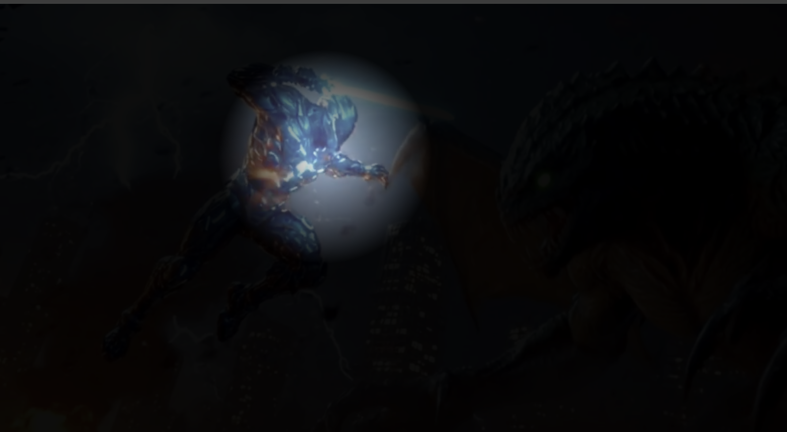

## 🎯 Mouse Spotlight Reveal Effect
A smooth and modern mouse-tracking spotlight effect built using HTML, CSS, and JavaScript. As the user moves the cursor, a circular spotlight reveals the background video underneath. Perfect for creative UI effects, hero sections, and modern landing pages.

## 🌐 Live Demo
https://dev-hamza03.github.io/mouse-spotlight-effect/

## 📁 GitHub Repository
https://github.com/dev-hamza03/mouse-spotlight-effect

## ✨ Features
- Background video with zoom effect
- Interactive spotlight following cursor
- Radial-gradient reveal animation
- Smooth real-time tracking
- Pure HTML, CSS, and JavaScript
- Clean, responsive layout
- Lightweight & fast (no libraries)

## 🖼️ Screenshot
(Add your screenshot in the repo before using the URL)


## 🛠️ Technologies Used
- HTML5
- CSS3 / SCSS
- JavaScript (Vanilla)
- Radial Gradient
- Video Background

## 📂 Project Structure
```
mouse-spotlight-effect
├── index.html
├── style.css / style.scss
├── script.js
└── assets
    ├── videos/
    └── images/
```

## 🚀 Getting Started
Clone the repository:
```
git clone https://github.com/dev-hamza03/mouse-spotlight-effect
```
Then open index.html in your browser.

## 💡 How It Works
1. CSS sets a radial-gradient spotlight using CSS variables --x and --y.
2. JavaScript updates these variables based on mouse movement.
3. The gradient center moves smoothly, revealing the video underneath.

## 📜 Core Logic

JavaScript:
```
document.addEventListener("mousemove", (e) => {
    document.documentElement.style.setProperty("--x", e.clientX + "px");
    document.documentElement.style.setProperty("--y", e.clientY + "px");
});
```

CSS Spotlight:
```
background: radial-gradient(200px at var(--x) var(--y), rgba(255, 255, 255, 0.35), rgba(0, 0, 0, 0.95));
```

## 🔮 Future Enhancements
- Smooth delayed spotlight movement
- Multi-color spotlight modes
- Spotlight blur softness control
- Mobile touch spotlight
- Text reveal inside spotlight
- Dark / light theme toggle

## ⭐ Support
If you like this project, please star the repository ⭐ — your support motivates me to build more creative effects!

## 📜 License
This project is open-source and free to use.
